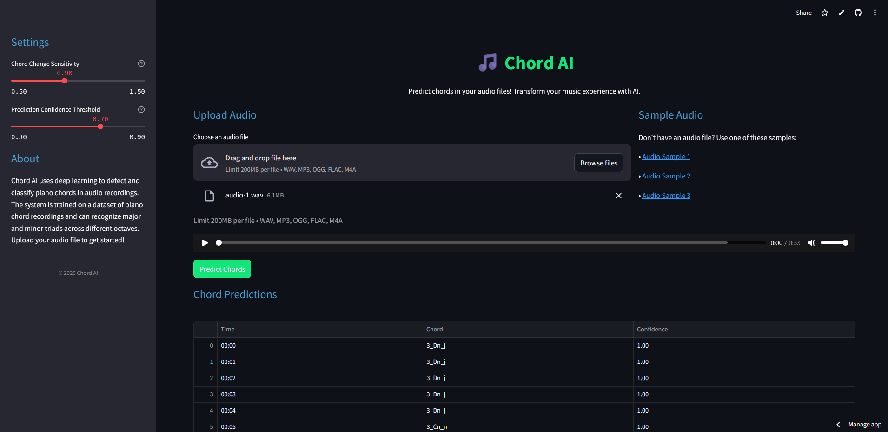

# Chord AI

Chord AI is an interactive web application that uses deep learning to detect and classify piano chords in audio recordings. The system is trained on a dataset of piano chord recordings and can recognize major and minor triads across different octaves.

🔗 **Live Demo**: [https://chord-ai.streamlit.app/](https://chord-ai.streamlit.app/)



## Features

- Analyze audio files to predict chord progressions
- Adjustable sensitivity for different types of recordings
- Real-time processing with visual progress indicators
- Clean, intuitive user interface
- Support for multiple audio formats (WAV, MP3, OGG, FLAC, M4A)

## How It Works

Chord AI uses a fine-tuned Wav2Vec 2.0 model specifically adapted for chord classification. The application:

1. Detects onset points (chord changes) in the audio
2. Extracts audio segments at these points
3. Processes each segment through the neural network
4. Identifies the most likely chord based on the model's predictions
5. Presents results in an easy-to-read format

## Installation

### Prerequisites

- Python 3.8 or higher
- pip package manager

### Setup

1. Clone this repository:
   ```bash
   git clone https://github.com/mustimusik/Chord-AI-Interface
   cd chord-ai
   ```

2. Install dependencies:
   ```bash
   pip install -r requirements.txt
   ```

3. Run the application:
   ```bash
   streamlit run app.py
   ```

## Usage

1. Upload an audio file (WAV, MP3, OGG, FLAC formats supported)
2. Adjust sensitivity settings in the sidebar if needed
3. Click "Predict Chords" to process your audio
4. View results in table format

For best results, use recordings with clear chord changes and minimal background noise.

## Deployment

### Deploy to Streamlit Cloud

1. Fork this repository to your GitHub account
2. Go to [share.streamlit.io](https://share.streamlit.io/) and sign in
3. Create a new app, select your forked repository
4. Configure the app settings (main file: app.py)
5. Deploy!

### Local Deployment

You can run the app locally with:

```bash
streamlit run app.py
```

The app will be available at http://localhost:8501

## Technical Details

- **Model**: Adapted Wav2Vec 2.0 from mustimusik/sec1-72label-v2_2
- **Backend**: Built with Streamlit, librosa, and PyTorch
- **Audio Processing**: Utilizes librosa for onset detection and audio analysis
- **Supported Audio Formats**: WAV, MP3, OGG, FLAC, M4A

## Project Structure

```
chord-ai/
├── app.py              # Main Streamlit application
├── requirements.txt    # Python dependencies
├── README.md           # This documentation
└── demo.png            # Screenshot
```

## Requirements

```
streamlit
torch
transformers
librosa
numpy
pandas
requests
```

---

Created by Musti Musik